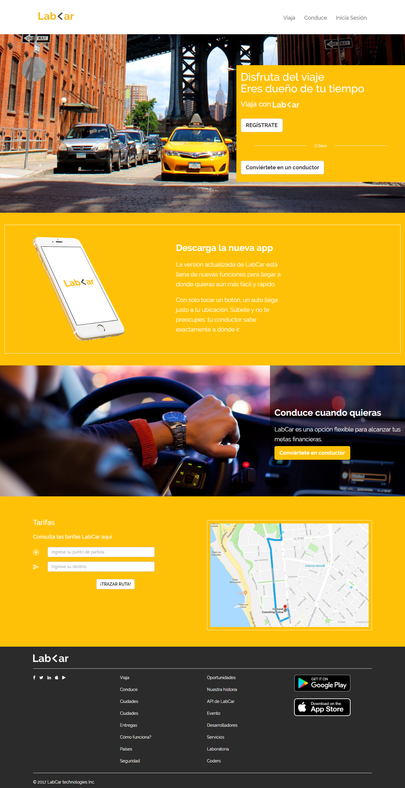
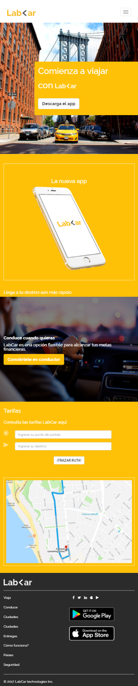
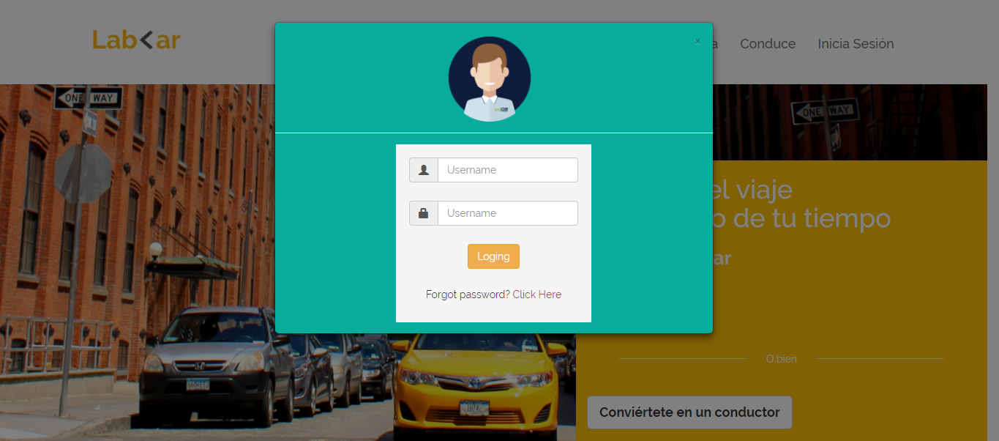
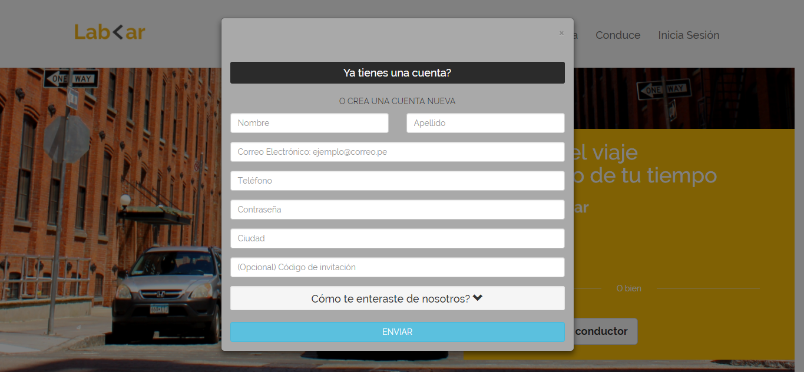
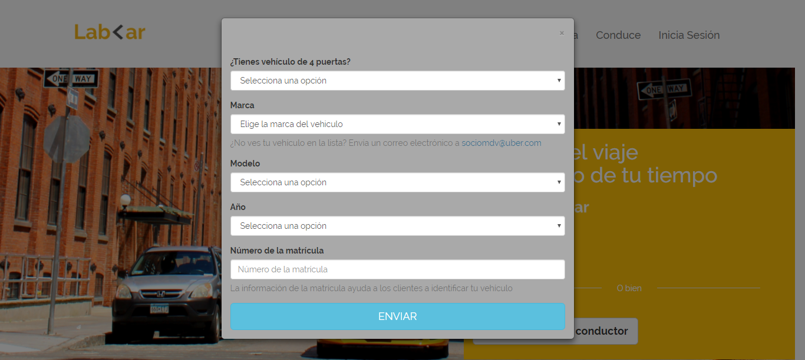

# Reto de Código - LabCar

* **Track:** _Common Core_
* **Curso:** _Crea tu propia red social_
* **Unidad:** _No reinventes la rueda_

***

## Objetivo

Este reto consiste en replicar una página, para ello se utilizará una estructura específica dada por Laboratoria.

## Especificaciones

* Se presentan dos versiones: desktop y mobile.
* La versión desktop: ≥ 768px.
* La versión mobile: < 768px.
* Se utilizó el framework Bootstrap en su versión 3.3.7.
* Se añadieron modales a la versión web en los botones: Inicia sesión, Regístrate, y Conviértete en conductor.
* El archivo index.html contiene la estructura de la página, y se enlaza a los archivos css y javascript del framwork, así como al archivo main.css creado para dar estilo específicos al proyecto.
* En la carpeta “assets” se almacenan las imágenes utilizadas en el archivo html (images) y en el Readme.md (docs).
* Esta página utiliza la tipografía Raleway.
* La paleta de colores, usada principalmente en los fondos, son los siguientes: #ffc107, #ffffff, #2b2b2b, #a9a9a9, #08ac9d.

La estructura de la página es la siguiente:

1. **LA VERSIÓN WEB (Desktop)**

2. **LA VERSIÓN MOVIL**

3. **MODALES**
* **Modal de Inicia Sesión**

* **Modal de Regístrate**

* **Modal de Conviértete en conductor**
